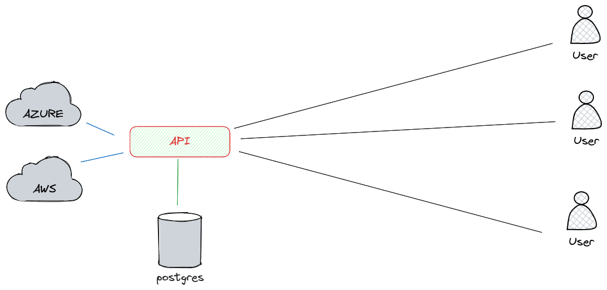

# Document Recognition

The project is designed to let user upload and store user documents, find person by face. It consists of 2 parts:

* Backend: API written in Python using Django
* Frontend: desktop application written in React using Tauri

## Installation

To install an application, just download installator for your operation system from the most recent release and run it.

## Flow

## Architecture

#### Backend utilizes:

* [face_recognition](https://github.com/ageitgey/face_recognition) - for face vectorization.
* [AWS Rekognition](https://aws.amazon.com/rekognition/) - to find document on the image.
* [AWS Textract](https://aws.amazon.com/textract/) - to extract text from the document (ELS only).
* [Azure AI Document Intelligence](https://azure.microsoft.com/en-us/products/ai-services/ai-document-intelligence) - to extract text from the document (Driving license, Identity card).
* [pgvecto.rs](https://github.com/tensorchord/pgvecto.rs) - to store and compare face vectors.

#### Frontend utilizes:

* [React](https://react.dev/) - for building user interface.
* [Shadcn](https://ui.shadcn.com/) - as a componenet library.
* [React Query](https://tanstack.com/query/latest) - for data fetching, caching and auto refetching.
* [Zod](https://github.com/colinhacks/zod) - for typescript schema validation.
* [Tauri](https://tauri.app/) - to deliver React application as a desktop application.

## Folder structure

* **document-generation** (R&D) - folder contains primary research. It is not used in production. It contains notebooks for different tasks:
    * Face generation using [stylegan3](https://github.com/NVlabs/stylegan3) library.
    * Document generation using [opencv](https://opencv.org/).
    * Document analysis
    * Document face extraction, vectorization and comparison

    The folder also contains geneated documents and faces that can be utilized for testing.

* **api** - folder contains Django project that is hosted separatly. It utilizes some
functions from R&D folder.

* **db** - folder contains database experimental features and can provide an idea how vectors are stored in production.

* **ui** - first version of the ui written in [PySide](https://wiki.qt.io/Qt_for_Python). At some
point we recognized that UI we want to build is too complex for PySide and decided to switch to React with Tauri.

* **tui (Tauri UI)** - folder contains React project delivered as a desktop application using [Tauri](https://tauri.studio/).

* **assets** - folder contains images used in README.

* **docker** - we dockerized the api so some relevant files are stored here.

* **personal** - our project also works with real ELS and Driving license documents. For convinience and testing purposes it can be safely stored in this folder as the content is not pushed to the repository.

* **.github** - contains workflows for the project. We have full CI/CD pipeline for the project. Backend is fetched from the repository and dockerized using Portainer (https://www.portainer.io/).
Frontend is being built by Github Actions and deployed to the release page.

The Repository also has pre-commit hooks to ensure code quality and utilizes some convinient tools such as:

* [mise](https://github.com/jdx/mise) - to simplify some everyday tasks and tools installation.
* [pip-tools](https://github.com/jazzband/pip-tools) - a set of command line tools to help manage python packages.
