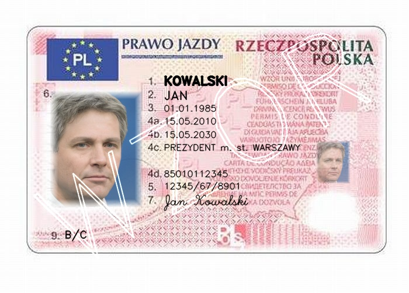

# Document Recognition

The project is designed to let users upload and store personal information, extract data from recognized document types, and identify individuals by face.

## Installation

To install an application, just download installator for your operation system from the most recent release and run it.

## Flow

1) Install application (see Installation section).
2) On the main screen you can see list of stored persons.

3) To add a new person click on the "Add person" button.

4) Fill in the form and click "Create". You must provide a document or user face image to proceed. The document must contain a photo of the person's face.
    If you provide a document, the application will try to extract the face from the document and fill in the form automatically.
    To use this feature the document must be one of the following types:
    * ELS
    * Driving license
    * Identity card

    If the document is not recognized, you can fill in the form manually. If you try on a test document (from `document-generation` folder) and a form is not populated it means this time the document was not recognized -- try another document.
    If any of the test documents is recognized -- it is bug, please contact us.
    The form is validated so the user won't be able to submit the form without face image.
5) After the form is submitted and no user with the same PESEL found in the database new user will be automatically appear on the main screen in the list.
6) To delete a record click on the dots on the right side of the record and click "Delete".

8) To edit a record click on the dots on the right side of the record and click "Edit".
    There you can update the person's data except face and pesel.

9) To filter records by person face click 'Find Person' button and provide users document or face image. It can be any document with face or just a face image. It shouldn't be the same photo as one provided during
    creation of the record. The application will try to find the most similar face in the database and show the record. Note: search is entirely in the database, so it is optimized and fast. Note: it may return more than one record.

10) To clear filter press 'Clear Filter' button. The screen will show all records again.

## Example documents

#### Driving licence

#### ELS

#### Identity card

More of them are inside corresponding subfolders of  `document-generation` folder.

## Architecture

The project consists of 2 parts:

* **Backend**: API written in Python using Django
* **Frontend**: desktop application written in React using Tauri

#### Backend utilizes:

* [face_recognition](https://github.com/ageitgey/face_recognition) - for face vectorization.
* [AWS Rekognition](https://aws.amazon.com/rekognition/) - to find document on the image.
* [AWS Textract](https://aws.amazon.com/textract/) - to extract text from the document (ELS only).
* [Azure AI Document Intelligence](https://azure.microsoft.com/en-us/products/ai-services/ai-document-intelligence) - to extract text from the document (Driving license, Identity card).
* [pgvecto.rs](https://github.com/tensorchord/pgvecto.rs) - to store and compare face vectors.

#### Frontend utilizes:

* [React](https://react.dev/) - for building user interface.
* [Shadcn](https://ui.shadcn.com/) - as a componenet library.
* [React Query](https://tanstack.com/query/latest) - for data fetching, caching and auto refetching.
* [Zod](https://github.com/colinhacks/zod) - for typescript schema validation.
* [Tauri](https://tauri.app/) - to deliver React application as a desktop application.

## Folder structure

* `document-generation` (R&D) - folder contains primary research. It is not used in production. It contains notebooks for different tasks:
    * Face generation using [stylegan3](https://github.com/NVlabs/stylegan3) library.
    * Document generation using [opencv](https://opencv.org/).
    * Document analysis
    * Document face extraction, vectorization and comparison

    The folder also contains geneated documents and faces that can be utilized for testing.

* `api` - folder contains Django project that is hosted separatly. It utilizes some
functions from R&D folder.

* `db` - folder contains database experimental features and can provide an idea how vectors are stored in production.

* `ui` - first version of the ui written in [PySide](https://wiki.qt.io/Qt_for_Python). At some
point we recognized that UI we want to build is too complex for PySide and decided to switch to React with Tauri.

* `tui (Tauri UI)` - folder contains React project delivered as a desktop application using [Tauri](https://tauri.studio/).

* `assets` - folder contains images used in README.

* `docker` - we dockerized the api so some relevant files are stored here.

* `personal` - our project also works with real ELS and Driving license documents. For convinience and testing purposes it can be safely stored in this folder as the content is not pushed to the repository.

* `.github` - contains workflows for the project. We have full CI/CD pipeline for the project. Backend is fetched from the repository and dockerized using Portainer (https://www.portainer.io/).
Frontend is being built by Github Actions and deployed to the release page.

The Repository also has pre-commit hooks to ensure code quality and utilizes some convinient tools such as:

* [mise](https://github.com/jdx/mise) - to simplify some everyday tasks and tools installation.
* [pip-tools](https://github.com/jazzband/pip-tools) - a set of command line tools to help manage python packages.
